# Optional RSC Runtime and Workbench topology

The RSC runtime is an opt-in development capability. A normal Agent Bundle
project remains on the portable artifact path; it does not load the example
provider, React Server Components packages, or a Runtime controller.

<!-- BEGIN GENERATED RSC RUNTIME TOPOLOGY -->
```text
packages/
  agent-bundle/
    src/adapters/claude.ts
    src/adapters/codex.ts
    src/adapters/portable.ts
    src/adapters/registry.ts
    src/adapters/types.ts
    src/build/build.ts
    src/build/emit.ts
    src/build/entries.ts
    src/build/manifest.ts
    src/build/mcp-apps.ts
    src/build/provenance.ts
    src/build/validate-artifact.ts
    src/config/index.ts
    src/config/load.ts
    src/config/normalize.ts
    src/config/validate.ts
    src/core/digest.ts
    src/core/project-context.ts
    src/core/types.ts
    src/dev/foreground-server.ts
    src/dev/hook-playground-service.ts
    src/dev/mcp-app-binding-service.ts
    src/dev/mcp-app-preview-service.ts
    src/dev/mcp-app-routes.ts
    src/dev/mcp-app-runtime-binding-service.ts
    src/dev/mcp-app-runtime-preview-service.ts
    src/dev/mcp-session-service.ts
    src/dev/project-service.ts
    src/dev/runtime-app-message-limits.ts
    src/dev/runtime-client-surface-proxy.ts
    src/dev/runtime-controller.ts
    src/dev/runtime-generation-store.ts
    src/dev/runtime-mcp-registry.ts
    src/dev/runtime-mcp-routes.ts
    src/dev/runtime-provider-loader.ts
    src/dev/runtime-provider.ts
    src/dev/runtime-routes.ts
    src/dev/workbench-server.ts
    src/index.ts
    src/services/playground-service.ts
    tests/dev-artifact-service.test.ts
    tests/dev-workbench-packaging.test.ts
    tests/dev-workbench.test.ts
    tests/host-adapters.native.test.ts
    tests/host-adapters.test.ts
    tests/mcp-app-binding-service.test.ts
    tests/mcp-app-bridge.test.ts
    tests/mcp-app-host-profiles.test.ts
    tests/mcp-app-metadata.test.ts
    tests/mcp-app-preview-service.test.ts
    tests/mcp-app-routes.test.ts
    tests/mcp-app-runtime-binding-service.test.ts
    tests/mcp-app-runtime-preview-service.test.ts
    tests/mcp-app-sandbox.test.ts
    tests/mcp-session-routes.test.ts
    tests/mcp-session-service.test.ts
    tests/normalization.test.ts
    tests/playground-service.test.ts
    tests/portable-adapter.test.ts
    tests/public-api.test.ts
    tests/rsc-runtime-optional-packaging.test.ts
    tests/runtime-client-surface-proxy.test.ts
    tests/runtime-generation-store.test.ts
    tests/runtime-mcp-registry.test.ts
    tests/runtime-mcp-routes.test.ts
    tests/runtime-provider.test.ts
    tests/runtime-routes.test.ts
  workbench/
    rsbuild.config.ts
    scripts/capture-runtime-playground.mjs
    src/inspector/adapter/inspector-session-adapter-entry.ts
    src/inspector/adapter/inspector-session-adapter-model.ts
    src/inspector/adapter/inspector-session-adapter.css
    src/inspector/adapter/inspector-session-adapter.tsx
    src/inspector/adapter/protocol-screen-without-replay.tsx
    src/inspector/adapter/runtime-app-bridge.ts
    src/main.tsx
    src/mcp/mcp-app-client.ts
    src/mcp/mcp-app-frame.tsx
    src/mcp/mcp-app-preview.tsx
    src/mcp/mcp-page.tsx
    src/mcp/mcp-session-controller.ts
    src/mcp/mcp-session-model.ts
    src/mcp/runtime-mcp-handoff.ts
    src/project-client.ts
    src/runtime-client.ts
    src/runtime-inspector.tsx
    src/runtime-model.ts
    src/runtime-playground.tsx
    src/runtime-stage.tsx
    src/styles.css
    tests/helpers/runtime-playground-fixture.ts
    tests/inspector-modern-mcp-types.test.ts
    tests/inspector-session-adapter-fixture.test.ts
    tests/inspector-session-adapter.test.ts
    tests/inspector-shell.e2e.test.ts
    tests/mcp-app-client.test.ts
    tests/mcp-app-frame.test.ts
    tests/mcp-app-preview-browser.test.ts
    tests/mcp-app-preview.test.ts
    tests/mcp-app-real.e2e.test.ts
    tests/mcp-page-app-browser.test.ts
    tests/mcp-session-controller.test.ts
    tests/mcp-session-model.test.ts
    tests/mcp-session-timeout.e2e.test.ts
    tests/runtime-app-bridge.test.ts
    tests/runtime-client.test.ts
    tests/runtime-contract-compile.test.ts
    tests/runtime-inspector.test.ts
    tests/runtime-mcp-handoff.test.ts
    tests/runtime-model.test.ts
    tests/runtime-playground-capture.test.ts
    tests/runtime-playground-hmr.e2e.test.ts
    tests/runtime-playground.browser.test.tsx
    tests/runtime-playground.e2e.test.ts
    tests/runtime-playground.test.ts
    tests/runtime-stage.test.ts
examples/
  rsc-agent-runtime/
    package.json
    rsbuild.config.ts
    scripts/capture-widget.mjs
    scripts/eval-evidence.mjs
    scripts/eval-host-environment.mjs
    scripts/eval-hosts.mjs
    scripts/package-hosts.mjs
    src/build/emit-artifacts.ts
    src/build/serialize-definition.ts
    src/definition.ts
    src/dev/definition-entry.ts
    src/dev/generation-materializer.ts
    src/dev/inspection-security.ts
    src/dev/invocation-worker.ts
    src/dev/provider.ts
    src/dev/rsbuild-runtime-session.ts
    src/dev/serialize-inspection.ts
    src/flight/request-render.ts
    src/hook/cli.ts
    src/hook/normalize.ts
    src/mcp/create-server.ts
    src/mcp/handlers.ts
    src/mcp/host-metadata.ts
    src/mcp/http-security.ts
    src/mcp/http.ts
    src/mcp/resolve-state.ts
    src/mcp/stdio.ts
    src/rsc/client-anchor.ts
    src/rsc/components.tsx
    src/rsc/routes.tsx
    src/rsc/worker.tsx
    src/runtime/contracts.ts
    src/runtime/elements.ts
    src/runtime/lower-hook.ts
    src/runtime/lower-mcp.ts
    src/runtime/request-context.ts
    src/runtime/state-file-core.ts
    src/runtime/state-file-test-support.ts
    src/runtime/state-file.ts
    src/types/mcp-ext-apps-react.d.ts
    src/types/react-server-dom-rspack.d.ts
    src/types/styles.d.ts
    src/widget/App.tsx
    src/widget/host-adapters.ts
    src/widget/index.tsx
    src/widget/styles.css
    tests/dev-invocation.integration.test.ts
    tests/dev-provider.integration.test.ts
    tests/docs-contract.test.ts
    tests/eval-evidence.test.ts
    tests/generation-materializer.test.ts
    tests/host-artifacts.test.ts
    tests/host-extensions.test.tsx
    tests/http-security.test.ts
    tests/mcp-lowering.test.tsx
    tests/mcp-transports.integration.test.ts
    tests/rsc-hook.integration.test.ts
    tests/runtime-artifact-manifest.test.ts
    tests/state-and-definition.test.ts
    tests/widget-accessibility.test.tsx
    tsconfig.json
```
<!-- END GENERATED RSC RUNTIME TOPOLOGY -->

## Boundaries and ownership

One registry-driven configuration flow serves every target. A bundled adapter
registers a unique descriptor in `TargetRegistry`; declaration merging exposes
the adapter-owned field through `AgentBundleConfigExtensions`; configuration
loading sorts and freezes strict finite-JSON extension values; and the canonical
artifact digest selects the owning target adapter. Ordinary projects take the
same flow with an empty extension set. Host-specific adapter values stay in
their adapter, and Runtime plus local host-profile simulations consume this
flow instead of creating another parser, registry, or digest lane.

`agent-bundle`'s Rslib build publishes the library/package. The example's
explicit production Rsbuild command builds RSC/runtime artifacts, while its
long-lived Rsbuild development session is a separate, example-owned compiler
and HMR lane. `AgentBundleDevRuntimeConfig.provider` is loaded by
`DevRuntimeController`, which delegates to the example's
`createDevRuntimeProvider` and `RsbuildRuntimeSession`.

The Workbench has one `Workbench` root and navigation authority. Runtime is the
optional fourth top-level `WorkbenchPage` (`overview`, `skills`, `mcp`,
`runtime`); Inspector is a nested MCP presentation, not a fifth shell sibling.
The root owns one `ProjectClient` and EventSource, one `McpAppClient`, and one
shared `McpSessionController`. It creates one Runtime controller only when the
project status advertises the configured runtime capability. `WorkbenchScreen`
is not the sole shell renderer: Overview and Skills use their own wrappers.

`PlaygroundService` is the provider-neutral durable whole-plugin authoring
timeline. The current Runtime Playground's `runtime-model.ts::historyFor`
history is provider-session-scoped and capped at 50 entries, and a render trace
is local to that invocation. Durable Runtime export/evaluation promotion,
provider adapters, authenticated APIs, and timeline UI ownership are not wired
by this topology.

Artifact epoch, runtime generation, state version, definition digest, MCP
session, and run identity are separate axes. A generation is staged and
validated, then atomically activated; leases keep the immutable generation
available for a selected run. Failed preparation retains the last good active
generation. Static MCP definitions and the broker survive independently of
generation-pinned invocations and binding authority.

The RSC result tree is not the MCP App document. A current preview moves through
`McpAppPreview`, `SecureAppRenderer`, the official App renderer, the
generation-bound bridge, and the runtime client-surface proxy to an opaque-origin
App iframe. The direct frame, bridge, handoff, proxy, message-limit, binding,
preview-service, routes, mounted-page, and real-browser tests retained above
are the single lifecycle boundary for that binding.

Portable is the baseline. ChatGPT/OpenAI and Claude Workbench profiles are local
compatibility simulations, not vendor certification. Native terminal evidence
is captured separately and truthfully describes CLI observations; it does not
claim MCP App iframe support.

```mermaid
flowchart LR
  Save["Source edit"] --> Rsbuild["Example-owned Rsbuild compiler"]
  Rsbuild --> Stage["Stage and validate complete generation"]
  Stage --> Activate["Atomically activate runtime generation"]
  Activate --> Event["runtime.generation.activated"]
  Event --> Replay["Workbench replays selected fixture"]
  Replay --> Lease["Lease immutable generation"]
  Lease --> Worker["Disposable RSC worker"]
  Worker --> Flight["Flight stream"]
  Flight --> Lower["Decode and lower native hook/MCP result"]
  Lower --> Model["Agent-visible result"]
  Lower --> Bridge["Generation-bound MCP App bridge"]
  Bridge --> Frame["Opaque-origin App iframe"]
```



## Keeping this map current

`npm run docs:runtime-topology` regenerates only the marked file tree from a
fixed Git allowlist. `npm run check:runtime-topology` compares bytes without
writing. The generator intentionally excludes generated output, dependencies,
runtime state, unrelated historical tests, and the vendored Inspector source so
the map remains an implementation boundary rather than a repository inventory.
