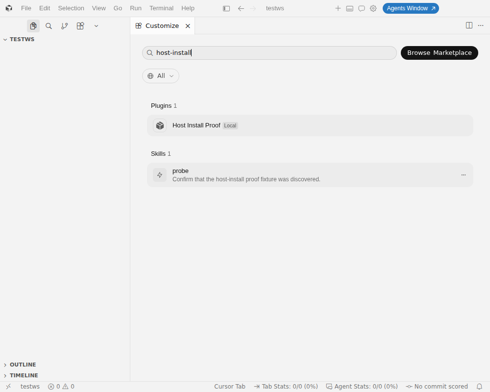
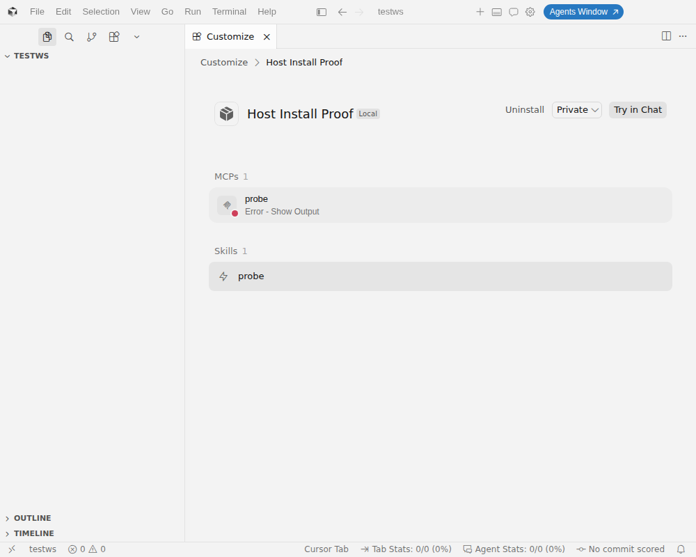
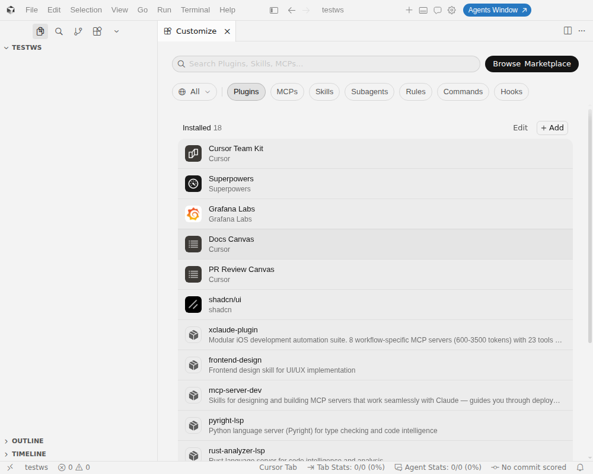

# Cursor IDE dogfood proof — portable Agent Plugins target

Date: 2026-09-02. Observed client: Cursor 3.18.25 stable, commit
`280eca2911f1774689696e5f1efa5a4f97a87af3`, Linux x64 AppImage, run as an
isolated instance (dedicated `HOME`, dedicated `--user-data-dir`, Xvfb
display). Package under test: the `portable` target artifact of the
host-install fixture (`plugin.json` name `host-install-proof`, version
`1.0.0`), installed with the artifact's own emitted `install.mjs` into the
isolated home's `~/.cursor/plugins/local/host-install-proof`.

This audit records what the real Cursor IDE plugin loader was observed doing.
It is separate from — and stronger on loader behavior than — the repeatable
`host-install` test proof, which validates installer execution, filesystem
shape, and pinned-schema conformance only and deliberately does not claim any
IDE observation.

## What the IDE established

1. **Discovery as an Agent Plugin.** After a restart the Customize page lists
   the package as plugin "Host Install Proof" with a `Local` badge; searching
   `host-install` returns the plugin and its skill.
   
2. **Skill discovery.** The `probe` skill is listed with the exact
   description string from the emitted `skills/probe/SKILL.md` frontmatter.
3. **MCP configuration discovery and launch attempt.** The plugin detail page
   shows `MCPs 1 (probe)` and `Skills 1 (probe)`; Cursor did not merely parse
   `mcp.json`, it spawned the configured stdio server.
   
4. **Honest absence of unsupported surfaces.** The detail page renders only
   MCPs and Skills sections for this plugin; no rules, commands, hooks, or
   subagents are attributed to it, matching the portable capability table.
   
5. **Successful stdio handshake.** With a launchable server configuration
   (see gaps below) the IDE log records `Successfully connected to stdio
   server` / `connection:connect_success` with a stable heartbeat
   (`~/.config/Cursor/logs/<session>/mcp-server-plugin-host-install-proof-probe.log`).

## Cursor 3.18.25 conformance gaps against Agent Plugins 1.0

All three were isolated by mutating only the installed copy's `mcp.json`
between IDE restarts and reading the per-server IDE logs. Spec citations are
to <https://agent-plugins.org/specification> (1.0.0, repository commit
`ff8ab5e392cc87bd88d87c060815a87490e51003`).

1. **`${PLUGIN_ROOT}` is not expanded in `cwd`.** §7.2.1 requires `args`,
   `env`, and `cwd` to support `${PLUGIN_ROOT}`/`${PLUGIN_DATA}` expansion,
   and the specification's own stdio example uses `"cwd": "${PLUGIN_ROOT}"`.
   Cursor passes the literal string as the working directory, so spawn fails
   with a misleading `spawn node ENOENT` — even for an absolute `command`
   with an existing binary.
2. **`${PLUGIN_ROOT}` is not expanded in `args`.** With `cwd` removed the
   server process starts, but Node receives the literal
   `${PLUGIN_ROOT}/mcp/<entry>.mjs` and exits with `MODULE_NOT_FOUND`
   (the literal resolves against the home directory).
3. **Omitted `cwd` does not default to the plugin root.** §7.2.1: "When
   `cwd` is omitted, clients MUST use the plugin root as the subprocess
   working directory." Observed default was the user's home directory.

Supplementary observation: replacing the spec placeholder with Cursor's
proprietary `${CURSOR_PLUGIN_ROOT}` in `args` produced a successful
connection with a stable heartbeat, confirming the loader has a working
expansion pipeline that is simply not wired to the standard's placeholder
names for this format. Bare `command` names (e.g. `node`) resolve normally
once `cwd` is valid.

## Consequence for the portable adapter

The portable emission (`cwd: "${PLUGIN_ROOT}"`, plugin-root-relative `args`)
is exactly what the specification prescribes and stays unchanged. Until
Cursor implements §7.2.1/§9.2 expansion for Agent Plugins, stdio MCP servers
from any spec-conformant portable package fail to launch on Cursor even
though the plugin, its skills, and its MCP configuration are all discovered
and surfaced correctly. This is tracked as adoption-issue evidence, not as an
adapter defect.

## Re-verification 2026-09-03 (#426)

Repeated on the same installed build (3.18.25, `realCommit`
`280eca2911f1774689696e5f1efa5a4f97a87af3`; no newer stable build was
available and the rendered Cursor changelog through Sep 2, 2026 carries no
plugin entry) with the emitted pack plus five single-variable probe plugins.
All three gaps above reproduced byte-for-byte (`spawn node ENOENT` for the
`cwd` shape, `Cannot find module '<HOME>/${PLUGIN_ROOT}/…'` for the `args`
shape, default `cwd` = `HOME`). The widened probe added three observations on
the same build: `${PLUGIN_ROOT}`/`${PLUGIN_DATA}` are not expanded in `env`
values (§9.2), the reserved `PLUGIN_ROOT`/`PLUGIN_DATA` subprocess variables
are not provided (§9.1), and a plugin-relative `./` `command` is resolved
against the workspace folder instead of the plugin root (§7.2.1). Full
table, log excerpts, and 1440×900 captures:
[`2026-09-03-agent-plugins-cursor-ide-proof.md`](./2026-09-03-agent-plugins-cursor-ide-proof.md).
No report is sent to Cursor (maintainer decision, 2026-09-03). No capability
row moved to `supported`.
