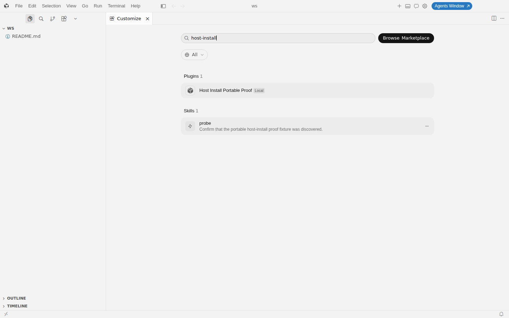
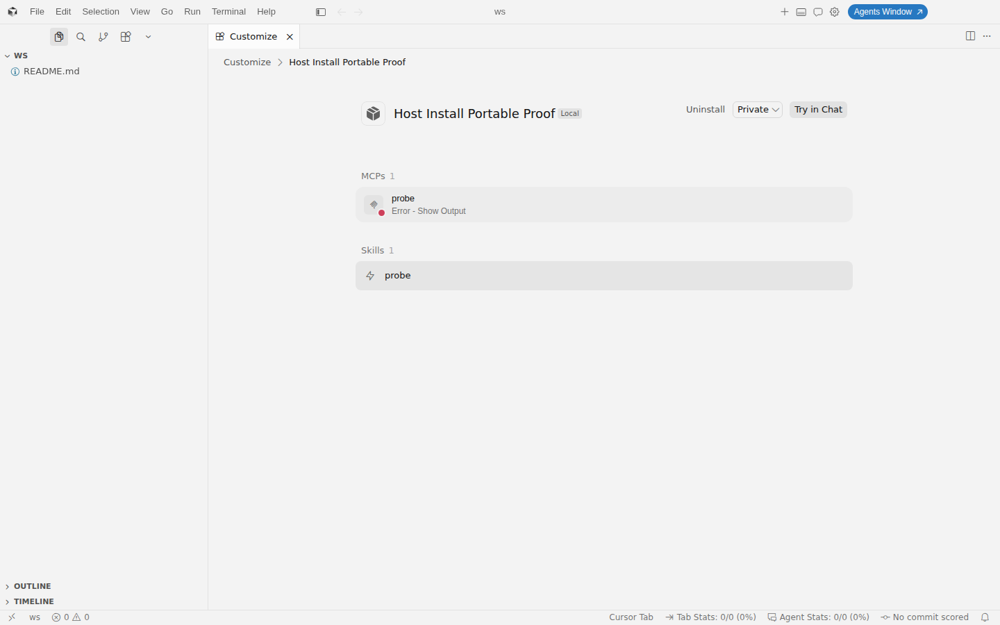
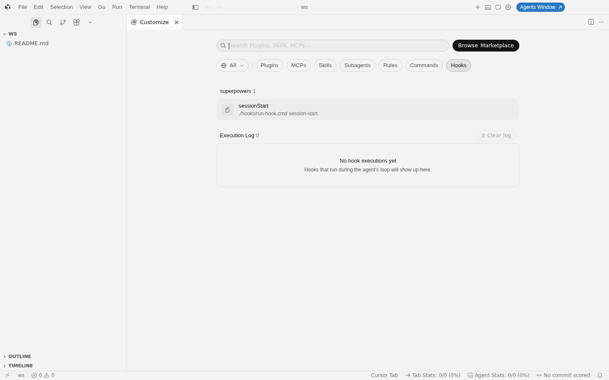
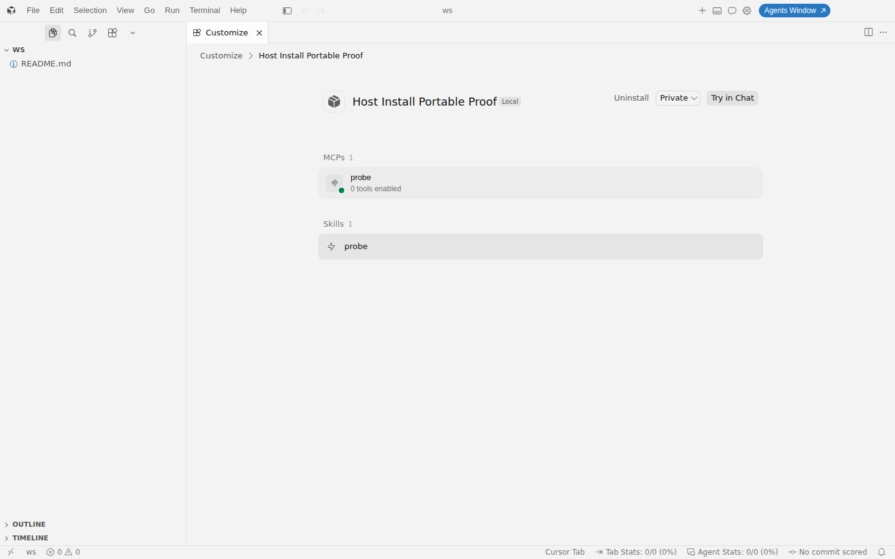
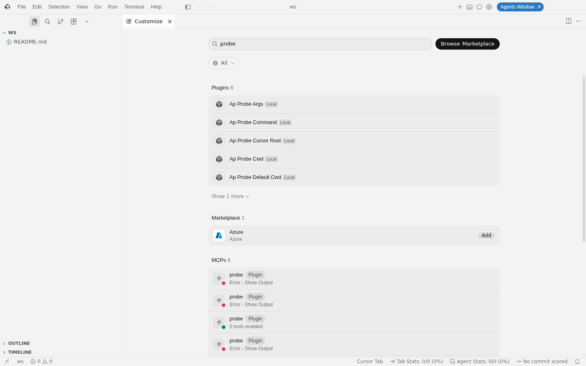

# Cursor IDE dogfood re-run — portable Agent Plugins target (#426)

Date: 2026-09-03. Observed client: Cursor **3.18.25** stable, Linux x64 deb
install at `/usr/share/cursor` (`product.json` `commit`
`280eca2911f1774689696e5f1efa5a4f97a87af0`, `realCommit`
`280eca2911f1774689696e5f1efa5a4f97a87af3`) — the same build the
[2026-09-02 proof](./2026-09-02-agent-plugins-cursor-ide-proof.md) observed.
No newer stable build was installed on this machine, and the rendered
<https://cursor.com/changelog> (Aug 13 – Sep 2, 2026 entries) contains no
plugin or placeholder-expansion entry, so this run is a re-verification on the
unchanged build rather than the "when a Cursor release notes placeholder
expansion" re-run the tracker asks for; that re-run stays open (see the
consequence section).

Harness: isolated instance — dedicated `HOME=/tmp/w426/iso/home`, dedicated
`--user-data-dir=$HOME/.config/Cursor`, `Xvfb :98 -screen 0 1440x900x24`,
`--remote-debugging-port=9334`, workspace `/tmp/w426/iso/ws`, window sized to
1440×900 (`innerWidth`/`innerHeight` confirmed before every capture; no capture
was taken while a loading state was visible). The real `~/.cursor` and
`~/.config/Cursor` were read only for the auth-row transplant the
[#407 harness](./2026-09-03-cursor-plugin-hooks-registration.md) documents.
Package under test: the `portable` target of the
`tests/fixtures/host-install-portable` fixture (`plugin.json` name
`host-install-portable-proof`, version `1.0.0`, `$schema`
`https://agent-plugins.org/schemas/1.0.0/plugin.schema.json`), built with the
workspace CLI (`dist/cli.js build`) from `origin/main` `4edbd493b`.

## 1. Install paths exercised

| Path | Command (isolated `HOME`) | Result |
| --- | --- | --- |
| Emitted installer, local mode (default) | `node ./install.mjs` | `Installed host-install-portable-proof@1.0.0 at ~/.cursor/plugins/local/host-install-portable-proof (content 6c00940d94ef)`; second run `Already installed …` (same content hash); receipt `.agent-bundle-install.json` written with `format: agent-bundle-install-receipt/1`. |
| Emitted installer, marketplace mode | `node ./install.mjs --mode marketplace` | Fails closed (exit 1) before touching the filesystem: "`--mode marketplace` requires a Cursor Plugin (`.cursor-plugin/plugin.json`); Cursor marketplaces resolve `plugins/<name>/.cursor-plugin/plugin.json`. This bundle is an Agent Plugins (root `plugin.json`) pack: use the default local mode." Cursor's marketplace manifest (`.cursor-plugin/marketplace.json`, <https://cursor.com/docs/reference/plugins#cursor-multi-plugin-repositories>) resolves only Cursor Plugin manifests, so there is no marketplace-mode path for this format to complete, interactively or not. |
| `agent-bundle install cursor --from <portable artifact> --mode local` / `--mode marketplace` | CLI from `packages/agent-bundle/bin/agent-bundle.js` | Both refuse with `AB7001` ("No cursor bundle manifest was found in …, its `cursor` target directory, or its `plugin` target directory"): `install cursor` is the Cursor Plugin (`.cursor-plugin/plugin.json`) entry point; Agent Plugins packs are delivered by their emitted `install.mjs`, exactly as `INSTALL.md` in the artifact says. |
| `agent-bundle doctor --host cursor` | after the local install | `0 error(s)`; one `AB7320` info per Agent Plugins entry: "Cursor plugin entry … is a root `plugin.json` declaring `https://agent-plugins.org/schemas/1.0.0/plugin.schema.json`, which Cursor loads as an Agent Plugins package; Doctor validated it against the pinned Agent Plugins 1.0.0 contract." Inventory finding: `{ entry, manifest: 'plugin.json', name, state: 'installed', version: '1.0.0' }`. |

Installed tree (six files, no `hooks/` directory, no `hooks.json`, no
`.cursor-plugin/`): `INSTALL.md`, `install.mjs`, `mcp.json`,
`mcp/mcp-probe-ba9c736f.mjs`, `plugin.json`, `skills/probe/SKILL.md`. The
fixture config declares a `sessionStart` hook; the portable emission drops it
because Agent Plugins 1.0.0 §7 defines only Skills and MCP servers, which the
repeatable proof asserts as `hooks: 'not-emitted'`
(`tests/host-install-proof.test.ts`).

Emitted `mcp.json` (spec shape, unchanged from the 2026-09-02 proof):

```json
{
  "$schema": "https://agent-plugins.org/schemas/1.0.0/mcp.schema.json",
  "mcpServers": {
    "probe": {
      "type": "stdio",
      "command": "node",
      "args": ["mcp/mcp-probe-ba9c736f.mjs"],
      "cwd": "${PLUGIN_ROOT}",
      "env": { "AGENT_BUNDLE_PLUGIN_ROOT": "${PLUGIN_ROOT}" }
    }
  }
}
```

## 2. What the IDE established (unchanged from 2026-09-02)

Plugins placed under `~/.cursor/plugins/local` were not picked up by the
first-boot plugin census (`workbench.mcp.files.log`: `Plugin MCP census:
{"trigger":"reset","providerOutcome":"timeout","descriptorsReceived":0,…}`); a
`Developer: Reload Window` produced
`{"trigger":"plugins_changed","providerOutcome":"ok","descriptorsReceived":19,
"pluginServersAssigned":19,…}` and every local plugin's stdio server was
spawned. Reload-after-copy is therefore still the loading contract, as
`INSTALL.md` states.

1. **Discovery as an Agent Plugin.** Customize lists "Host Install Portable
   Proof" with the `Local` badge; searching `host-install` returns the plugin
   (`Plugins 1`) and its skill (`Skills 1`).
   
2. **Skill discovery.** `probe` is listed with the exact frontmatter
   description "Confirm that the portable host-install proof fixture was
   discovered."
3. **MCP configuration discovery and launch attempt.** The plugin detail page
   shows `MCPs 1 (probe)` and `Skills 1 (probe)`; with the spec-shaped
   `mcp.json` the server row reads `Error - Show Output` and the per-server
   log records `spawn node ENOENT` (section 3, gap 1).
   
4. **Honest absence of unsupported surfaces.** The detail page renders only
   MCPs and Skills for this plugin. The Customize **Hooks** tab lists one hook
   (`superpowers` `sessionStart`, an account marketplace plugin) and nothing
   attributed to any Agent Plugins entry; a `probe` search returns Plugins,
   MCPs, and Skills sections only. The pack ships no hooks, Cursor attributes
   none, and Doctor's `hooks` registration field (emitted only for
   `.cursor-plugin/plugin.json` entries) is absent from the finding — the
   `AB7320` info states which contract was applied.
   
5. **Successful stdio handshake with a launchable configuration.** Rewriting
   only the installed copy's `mcp.json` to `args:
   ["${CURSOR_PLUGIN_ROOT}/mcp/mcp-probe-ba9c736f.mjs"]` (no `cwd`, env value
   `${CURSOR_PLUGIN_ROOT}`) and reloading produced `Successfully connected to
   stdio server` / `connection:connect_success` with a heartbeat
   (`exthost/anysphere.cursor-mcp/MCP plugin-host-install-portable-proof-probe.log`),
   and the detail row turned green ("0 tools enabled" — the fixture server
   registers no tools).
   

## 3. Placeholder-expansion re-verification (five probe plugins)

Five hand-written Agent Plugins 1.0.0 packs (`ap-probe-*`, root
`plugin.json` + `mcp.json` + one skill) were installed next to the emitted
pack, one variable each. Each `mcp.json` is a **valid** 1.0.0 server entry
(bare `command`, placeholders only in `args`/`env`/`cwd`) except the control,
so a conformant client MUST launch all of them (§7.2.1, §9.2, §11.1). The
`report.mjs` payload appends `{ cwd, argv, env }` to a marker file and then
idles on stdin; the inline `-e` probe does the same without depending on
`args` or `cwd` expansion. Evidence: `exthost/anysphere.cursor-mcp/MCP
plugin-<name>-probe.log`, `mcp-server-plugin-<name>-probe.workbench.log`, and
the marker file `launches.jsonl`.

| Probe | Server entry | Observed on 3.18.25 | Spec MUST | Status |
| --- | --- | --- | --- | --- |
| `ap-probe-cwd` (and the emitted pack) | `command: node`, `args: ["mcp/report.mjs"]`, `cwd: "${PLUGIN_ROOT}"` | `Connection failed: spawn node ENOENT` — the literal `${PLUGIN_ROOT}` is passed as the working directory, so the spawn fails before `PATH` lookup matters (the same bare `node` spawns fine in the two probes without `cwd`). | §7.2.1 "Clients MUST expand placeholders before resolving `cwd`"; §9.2 expansion applies to the `cwd` string. | **gap 1 persists** |
| `ap-probe-args` | `command: node`, `args: ["${PLUGIN_ROOT}/mcp/report.mjs"]`, no `cwd` | Node starts and exits: `Error: Cannot find module '/tmp/w426/iso/home/${PLUGIN_ROOT}/mcp/report.mjs'` (`MODULE_NOT_FOUND`), then `MCP error -32000: Connection closed`. | §9.2 expansion applies to "every string element of `args`". | **gap 2 persists** |
| `ap-probe-default-cwd` | `command: node`, `args: ["-e", "<record cwd/env>"]`, no `cwd`, `env: { PROBE_ROOT: "${PLUGIN_ROOT}", PROBE_DATA: "${PLUGIN_DATA}" }` | Marker: `cwd = /tmp/w426/iso/home` (the `HOME` of the instance, not the plugin root). | §7.2.1 "When `cwd` is omitted, clients MUST use the plugin root as the subprocess working directory." | **gap 3 persists** |
| same probe, env values | as above | Marker: `PROBE_ROOT = "${PLUGIN_ROOT}"`, `PROBE_DATA = "${PLUGIN_DATA}"` (literal). | §9.2 expansion applies to "every string value in `env`". | **gap 4 (new observation)** |
| same probe, reserved variables | as above | Marker: `process.env.PLUGIN_ROOT` and `process.env.PLUGIN_DATA` are `undefined`. | §9.1 "Clients that launch plugin subprocesses … MUST provide `PLUGIN_ROOT` and `PLUGIN_DATA` in each subprocess environment." | **gap 5 (new observation)** |
| `ap-probe-command` | `command: "./mcp/launch.sh"`, `args: []` | `Connection failed: spawn /tmp/w426/iso/ws/mcp/launch.sh ENOENT` — the plugin-relative command is resolved against the **workspace folder**, not the plugin root. | §7.2.1 "Clients … MUST resolve plugin-relative paths against the plugin root." | **gap 6 (new observation)** |
| `ap-probe-cursor-root` (control, not spec-conformant) | `command: node`, `args: ["${CURSOR_PLUGIN_ROOT}/mcp/report.mjs"]`, `env: { PROBE_ROOT: "${CURSOR_PLUGIN_ROOT}" }` | Marker: `argv[1] = /tmp/w426/iso/home/.cursor/plugins/local/ap-probe-cursor-root/mcp/report.mjs`, `PROBE_ROOT` expanded to the same root, `cwd = /tmp/w426/iso/home`. | n/a — Cursor's proprietary placeholder. | expansion pipeline exists and is wired to `${CURSOR_PLUGIN_ROOT}` only |



Read-out: the three gaps recorded on 2026-09-02 are reproduced byte-for-byte on
the same build, and the widened probe set shows the same root cause on every
§9 surface: Cursor's Agent Plugins loader performs no `${PLUGIN_ROOT}` /
`${PLUGIN_DATA}` expansion anywhere (`args`, `env`, `cwd`), does not inject
the §9.1 reserved variables, and resolves both the omitted `cwd` and
plugin-relative `./` commands against the wrong base (`HOME` and the
workspace folder respectively). Discovery, skills, and the launch pipeline are
correct; only the §7.2.1/§9 path contract is missing.

## 4. Consequence for the portable adapter and the tracker

- The emission stays as it is (`cwd: "${PLUGIN_ROOT}"`, cwd-relative `args`,
  `${PLUGIN_ROOT}` in `env`): it is the specification's own example shape and
  the only shape a conformant client is required to launch. Rewriting to
  `${CURSOR_PLUGIN_ROOT}` would make the portable pack non-portable and is not
  done.
- Capability rows (`packages/agent-bundle/src/adapters/capabilities/portable-1.0.0.json`,
  `mcp.evidence`) gain a dated 2026-09-03 line for the re-verification and the
  three additional observations; no row moves to `supported` because nothing
  was fixed.
- No report is sent to Cursor for the gaps #426 tracked (maintainer decision,
  2026-09-03); the evidence above and the `mcp.evidence` line are the record.
- The "re-run when a Cursor release notes placeholder expansion" item stays
  time-gated on a Cursor release; the harness above (`/tmp/w426/iso-setup.sh`
  shape: five probes + the emitted pack, reload, read the three log surfaces)
  is the procedure to repeat.
