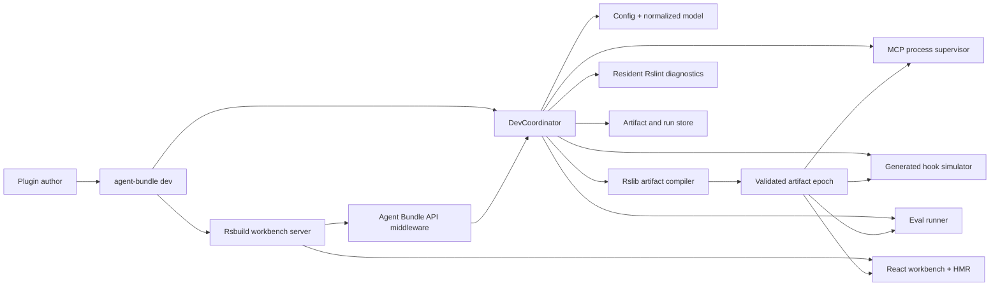
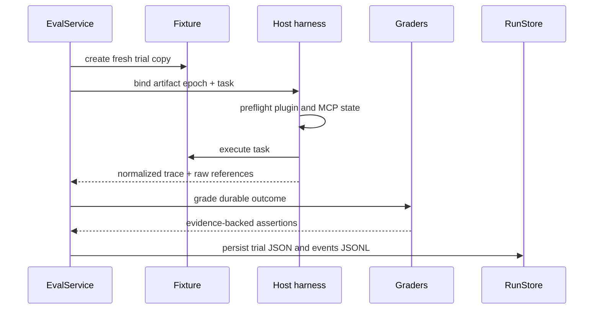

# Agent Bundle developer workbench design

**Status:** Proposed extension to the approved Agent Bundle architecture

**Date:** 2026-08-14

## Summary

`agent-bundle dev` is the development environment for authoring, inspecting, validating, and
evaluating agent plugins. It is not a static report and it is not a second agent host. It runs
as one foreground process with four coordinated responsibilities:

1. compile plugin artifacts with Rslib/Rspack;
2. serve a React workbench with Rsbuild and native HMR;
3. exercise generated Skill, MCP, and hook surfaces through shared application services;
4. run deterministic and native-host evaluation trials against immutable artifact epochs.

The workbench is useful to humans in a browser and to agents through the same typed service
layer. It does not introduce a daemon, database, hosted control plane, or runtime dependency in
generated plugins.

## Goals

1. Make every generated target inspectable before installing it into a real host.
2. Render Skill documents as polished documentation, including frontmatter and local resources.
3. Provide a protocol-level MCP playground bound to the exact generated artifact.
4. Simulate normalized hooks through the generated target wrapper rather than a separate model.
5. Run realistic plugin and Skill evals through native Codex and Claude CLI harnesses.
6. Keep source state, build state, host traces, and grader conclusions visibly distinct.
7. Preserve native Rsbuild HMR for the workbench while plugin artifacts rebuild independently.
8. Remain useful from the CLI and programmatic API when the browser is not open.

## Non-goals

- editing project source inside the browser;
- running as a background daemon after the command exits;
- auto-installing a candidate into the user's normal Codex or Claude configuration;
- proxying or replacing model-provider APIs;
- reproducing the full Codex or Claude interface;
- claiming that inferred Skill activation was directly observed;
- implementing a hosted eval service, team database, or marketplace;
- making Rsbuild frontend HMR stand in for plugin artifact invalidation.

## Tool assignment

Each Rstack tool has one job:

| Concern                                 | Tool         | Reason                                                              |
| --------------------------------------- | ------------ | ------------------------------------------------------------------- |
| Agent Bundle library and CLI output     | Rslib        | Produces the published ESM package and declarations.                |
| Generated hook, script, and MCP entries | Rslib/Rspack | Produces self-contained target executables.                         |
| Browser workbench                       | Rsbuild      | Provides the app build, dev server, routing, and HMR.               |
| Source diagnostics                      | Rslint       | One resident engine lints affected files in the foreground process. |
| Unit and integration tests              | Rstest       | Tests compiler, adapters, UI behavior, and harness normalization.   |
| Eval trial orchestration                | Agent Bundle | Owns fixtures, host processes, traces, graders, and comparisons.    |

Rslib has a CLI watch mode, but the Agent Bundle product graph also contains Markdown,
frontmatter, references, copied assets, marketplace files, and generated manifests. Agent Bundle
therefore owns invalidation and calls the public Rslib build API for coalesced artifact epochs.
Rslint does not expose a native watch command; the coordinator reuses one long-lived `Rslint`
instance and schedules affected-file lint calls. Rstest's own watch command remains available for
developing Agent Bundle itself and reruns affected tests from its module graph.

## Process architecture



There is one process owner. Every child process, watcher, Rslint engine, Rsbuild server, and eval
trial belongs to its lifecycle and closes on Ctrl-C or programmatic `close()`.

## Rsbuild workbench server

The first implementation uses Rsbuild's built-in dev server rather than a custom Express server.
An internal Rsbuild plugin registers Agent Bundle API middleware through
`dev.setupMiddlewares`. `startDevServer()` owns HTTP listening and native HMR.

This is simpler than middleware mode because the workbench has no first-release requirement for
a separately owned HTTP or WebSocket server. If a future integration truly needs to own the
server, Rsbuild's `createDevServer()`, `middlewares`, `connectWebSocket()`, and `afterListen()`
provide a supported migration path.

Two update channels remain distinct:

- Rsbuild HMR updates the workbench's React and CSS modules while Agent Bundle itself is being
  developed.
- Agent Bundle project events update normalized models, diagnostics, artifact epochs, MCP
  sessions, hooks, and eval runs.

Project events use a custom Rsbuild hot event for the browser. The CLI and agent-facing surfaces
read the same state through application services and HTTP/MCP APIs; they do not scrape browser
events.

The published package includes the compiled workbench modules and their source maps as internal
runtime entries. `agent-bundle dev` points a programmatic Rsbuild configuration at those entries,
so the browser is still served by a real Rsbuild compilation and dev server. Plugin-author files
are not injected into the frontend module graph; their state arrives through typed project
events. A production build of Agent Bundle may also emit static workbench assets for screenshots
and tests, but the `dev` command does not become a generic static-file server.

## Development coordinator

`DevCoordinator` is a small orchestration layer, not a second build system. It owns:

```ts
interface DevCoordinator {
  start(): Promise<DevSession>;
  rebuild(reason: Invalidation): Promise<ArtifactEpochResult>;
  status(): ProjectStatus;
  close(): Promise<void>;
}
```

Internally it delegates to focused services:

- `ProjectService`: loads config, discovers source components, and produces the normalized model;
- `ArtifactService`: builds and validates targets, then publishes immutable epochs;
- `DiagnosticService`: owns the resident Rslint instance and normalized diagnostics;
- `McpService`: starts generated MCP commands and exposes protocol operations;
- `HookService`: resolves native mappings and runs generated handlers with fixture events;
- `EvalService`: creates trials, launches harnesses, grades results, and compares runs;
- `RunStore`: persists schema-versioned JSON and JSONL artifacts.

Services are usable from the UI, CLI, and programmatic API. HTTP handlers contain no product
logic beyond input decoding and result encoding.

## Invalidation and artifact epochs

The watcher observes configuration, discovered skills, scripts, hooks, MCP sources, references,
assets, and target-specific extension files. Events are debounced into one invalidation batch.

```mermaid
sequenceDiagram
  participant FS as File watcher
  participant C as DevCoordinator
  participant L as Rslint
  participant B as Rslib build
  participant V as Artifact validator
  participant UI as Workbench

  FS->>C: changed paths
  par diagnostics
    C->>L: lint affected source
  and artifact rebuild
    C->>C: reload and normalize
    C->>B: compile selected target entries
    B->>V: emitted target directories
  end
  alt build and validation pass
    V-->>C: publish epoch N+1
    C-->>UI: artifact.available(N+1)
  else config, build, or validation fails
    V-->>C: failed attempt
    C-->>UI: artifact.failed; epoch N remains active
  end
```

An artifact epoch contains:

```ts
interface ArtifactEpoch {
  id: string;
  createdAt: string;
  projectRevision: string;
  configDigest: string;
  modelDigest: string;
  targetDigests: Record<TargetName, string>;
  manifestPath: string;
  diagnostics: DiagnosticSummary;
}
```

Only a fully emitted and validated build becomes active. On failure, the workbench keeps the last
good epoch available and labels it stale relative to the current sources. MCP processes and eval
trials never silently switch artifacts mid-run.

## Author configuration

The existing configuration gains optional development and eval sections:

```ts
export default defineConfig({
  // plugin, targets, skills, hooks, mcp, and other build fields
  dev: {
    open: true,
    port: 3100,
    lint: true,
    agentApi: false,
  },
  evals: {
    include: ["evals/**/*.eval.ts"],
    runsDir: ".agent-bundle/runs",
  },
});
```

`dev.agentApi` enables an optional agent-facing Streamable HTTP MCP endpoint on the foreground
workbench server. It is off by default because ordinary plugin development does not require an
additional MCP server.

Host credentials, subscription state, and model-provider keys are never stored in
`agent-bundle.config.ts`. Harness preflight reads the selected CLI's normal supported environment
or isolated home at run time.

## Workbench information architecture

### Overview

The landing page answers five questions without requiring navigation:

1. Did the current source normalize successfully?
2. Which artifact epoch is active, and is it current?
3. Which targets were generated?
4. Are there source, build, or artifact diagnostics?
5. What is the next useful action?

It shows a compact target matrix and the latest changed files. Raw logs remain one click away.

### Skills

The Skill page has a tree on the left and three synchronized tabs:

- **Rendered**: polished Skill documentation;
- **Source**: exact source Markdown;
- **Generated**: selected target's emitted `SKILL.md` and resource tree.

It also shows parsed frontmatter, referenced scripts/references/assets, validation diagnostics,
and direct/indirect/negative eval coverage.

### MCP playground

The MCP page is a protocol workbench bound to one artifact epoch:

- server catalog and transport configuration;
- explicit start, stop, and restart controls;
- initialization result and negotiated capabilities;
- tools, resources, resource templates, and prompts;
- JSON-Schema-generated input forms with raw JSON mode;
- result content blocks, structured content, errors, timing, and process logs;
- invocation history with exact input, output, epoch, and duration.

The playground invokes the generated command from the selected target. It does not import the MCP
source module directly, because that would bypass emitted path and dependency behavior.

### Hooks

The Hook page shows normalized intent beside each host mapping:

```text
beforeTool + shell
  Codex  -> <adapter native event> / <native shell selector> / dist/codex/hooks/check-command.mjs
  Claude -> <adapter native event> / <native shell selector> / dist/claude/hooks/check-command.mjs
```

Simulation accepts canonical fields or a saved fixture, transforms them into the selected host's
native event, runs the emitted wrapper, and decodes the native response back into a canonical
result. The page shows all three forms. This tests the compiled adapter rather than a separate
in-memory approximation.

### Artifacts

The Artifact page provides:

- target directory tree;
- source-to-output provenance;
- generated manifests with schema diagnostics;
- executable entry metadata;
- epoch-to-epoch file and digest diff;
- exact path used by MCP, hook, and eval operations.

### Evals

The Eval page provides:

- suites and cases;
- selected hosts, invocation mode, fixtures, and trial count;
- live trial status and normalized event trace;
- deterministic and semantic grader results;
- case-by-host/model matrix;
- pass rate, pass@k, pass^k, duration, and recorded token usage;
- baseline versus candidate comparison;
- links to raw run artifacts.

### Logs

Logs are grouped by producer: normalization, Rslib, Rslint, Rsbuild, MCP server, hook simulation,
host trial, and grader. The default view shows concise structured events; raw stdout/stderr is
available per process.

## Skill Markdown renderer

Skill documents need first-class rendering because they are the main authored interface.

The core parser reads YAML frontmatter and Markdown body once and returns:

```ts
interface SkillDocument {
  id: string;
  sourcePath: string;
  frontmatter: Record<string, unknown>;
  body: string;
  resources: SkillResource[];
  diagnostics: Diagnostic[];
}
```

The browser uses:

- `react-markdown` for React rendering;
- `remark-gfm` for tables, task lists, strikethrough, and autolinks;
- a lazy fine-grained Shiki integration for fenced code blocks;
- custom heading, link, image, table, code, and callout components.

The browser does not parse frontmatter again. It renders the structured metadata as a compact
field list above the document. Local links and images resolve through the workbench API using the
skill source path or selected artifact epoch. Clicking a source reference can reveal it in the
resource tree or open it in the user's editor.

The initial renderer supports CommonMark and GFM, not MDX. JSX in a Skill file is shown as text
instead of executed. Shiki languages and themes are loaded lazily so opening the workbench does
not download the full highlighter bundle.

## Agent-facing development MCP

When enabled, the workbench exposes a small Streamable HTTP MCP server backed by the same
services as the UI:

```text
project_status
skills_list
skill_inspect
artifacts_list
artifact_inspect
mcp_servers_list
mcp_invoke
hooks_list
hook_simulate
evals_list
eval_run
eval_get
diagnostics_list
```

This endpoint helps an agent inspect the plugin it is authoring. It is not embedded in generated
artifacts and exists only while `agent-bundle dev --agent-api` is running.

## Eval definition model

Eval suites are typed TypeScript modules discovered by convention:

```ts
import { defineEvalSuite } from "agent-bundle/eval";

export default defineEvalSuite({
  name: "review-change",
  cases: [
    {
      id: "direct-review",
      prompt: "Review this change and report the highest-risk regression.",
      fixture: "./fixtures/review-repo",
      hosts: ["codex", "claude"],
      invocation: {
        mode: "automatic",
        skill: "review-change",
      },
      trials: 3,
      assertions: [
        expectExitCode(0),
        expectOutcome({ script: "./graders/review-result.ts" }),
        expectToolCall({ name: "project_status", atLeast: 1 }),
        expectSkillActivation({ skill: "review-change" }),
      ],
    },
  ],
});
```

Invocation modes are:

- `automatic`: ask naturally and measure whether the host uses the plugin effectively;
- `explicit`: directly name or invoke the Skill to test its workflow after activation;
- `none`: negative case where the plugin should not be selected.

A useful suite includes direct, indirect, incomplete-information, negative, and edge cases. Eval
prompts do not include assertions, expected grader decisions, reference answers, or another
trial's outputs.

## Trial and grader model

The core vocabulary is explicit:

- **case**: one task, fixture, invocation mode, and assertion set;
- **trial**: one fresh execution of a case through a selected harness;
- **trace**: normalized host/process events plus references to raw output;
- **outcome**: final workspace and response state;
- **grader**: deterministic, model-based, or human judgment over the outcome;
- **run**: a group of cases and trials against one artifact epoch;
- **comparison**: aligned baseline and candidate runs.

Graders prefer durable outcomes over exact tool sequences. Deterministic checks run first:

- process exit and timeout;
- file/artifact existence and content;
- JSON Schema validation;
- repository checks or custom scripts;
- required or forbidden tool/MCP calls when they are part of the contract.

Optional semantic graders receive the task, assertions, final response, trace, and produced
workspace. They do not receive condition labels such as `with_skill` or `without_skill`.

Multiple trials are required before reporting reliability. The UI may display pass rate, pass@k,
and pass^k only when enough trials exist; otherwise it labels the result a smoke trial.

## Skill activation evidence

Activation telemetry differs by host. Agent Bundle stores an evidence level rather than forcing
false parity:

```ts
type ActivationEvidence = "observed" | "inferred" | "unavailable";
```

- Claude can expose Skill tool calls in its stream, so matching activation is `observed`.
- Codex plugin availability is observed through plugin state, while automatic Skill activation
  is `inferred` from behavior unless the CLI later exposes an authoritative event.
- A harness that cannot inspect either records `unavailable`.

Graders and reports may reason about inference, but must not relabel it as observation.

## Harnesses

### Deterministic harness

Runs without a model. It validates artifact trees, Skill resources, hook wrappers, scripts, and
MCP protocol behavior. It is the default in CI because it is fast and repeatable.

### Claude native harness

Claude supports direct plugin loading with `--plugin-dir`. The harness has two modes:

- `native-local`: uses the author's existing Claude authentication and records inherited runtime
  controls; intended for manual dogfooding;
- `native-isolated`: uses `--bare`, an explicit plugin directory, and supported API-key auth;
  intended for reproducible automation.

It runs `claude -p` with JSON or stream-JSON output and records the system initialization event,
loaded plugin, plugin errors, MCP state, Skill tool calls, hooks when emitted, tool calls, result,
usage, and raw stderr.

### Codex native harness

Codex does not provide a direct `--plugin-dir` equivalent. For an isolated trial, Agent Bundle:

1. creates a temporary `CODEX_HOME`;
2. materializes a temporary local marketplace referencing the generated Codex target;
3. installs the candidate with `codex plugin marketplace add` and `codex plugin add`;
4. verifies it with `codex plugin list --json`;
5. runs `codex exec --ephemeral --json` from a fresh fixture copy.

`native-local` may use the author's existing Codex setup for manual dogfooding, but its inherited
state is recorded. `native-isolated` uses the temporary home and supported API-key auth for CI.

### Future harness adapter

A narrow adapter interface may support external systems such as Inspect AI or Promptfoo. Native
CLI harnesses remain distinct because a bridge that reroutes model calls can change plugin-host
behavior.

## Clean trial lifecycle



Each trial starts from the same fixture digest. A candidate and baseline never share a mutable
workspace. Host startup, authentication, plugin-load, MCP-startup, timeout, or trace-collection
failures are harness failures rather than plugin failures.

## Run storage

No database is required. State is schema-versioned and inspectable:

```text
.agent-bundle/
└── runs/
    └── <run-id>/
        ├── run.json
        ├── events.jsonl
        ├── comparison.json
        ├── cases/
        │   └── <case-id>/
        │       └── <trial-id>.json
        └── artifacts/
            └── ...
```

Run provenance includes:

- Agent Bundle version and schema version;
- project revision and dirty-state digest;
- artifact epoch and target digests;
- fixture digest;
- host CLI and plugin versions;
- selected harness mode and model when recorded;
- timing, exit state, usage when reported, and raw log references;
- grader versions and assertion evidence.

## CLI and API

```bash
agent-bundle dev [--open | --no-open] [--port 3100] [--agent-api]
agent-bundle inspect --json
agent-bundle mcp list
agent-bundle mcp invoke <server> <tool> --input '{...}'
agent-bundle hooks list
agent-bundle hooks simulate <hook> --target claude --input fixture.json
agent-bundle eval [suite-or-case] --host codex --trials 3
agent-bundle eval compare <baseline-run> <candidate-run>
```

Programmatic entry points return structured handles and never require a browser:

```ts
const session = await startDevServer({ root, open: false });
const run = await runEvals({
  root,
  cases: ["direct-review"],
  hosts: ["claude"],
});
await session.close();
```

`--no-open` keeps the browser closed while still serving the workbench. Headless build, inspect,
MCP, hook, and eval work uses their dedicated CLI commands instead of maintaining a second
headless dev-server mode.

## Error and recovery behavior

- A config or normalization error prevents a new artifact epoch and leaves the last good epoch
  visible as stale.
- A target-specific build failure does not replace that target's active artifact.
- MCP startup and protocol errors are attached to the selected server and epoch.
- A malformed hook fixture is rejected before the generated command runs.
- A host CLI that is missing, unauthenticated, or incompatible fails preflight and creates a
  harness-failure trial record.
- A grader failure preserves the completed host trace and marks grading incomplete.
- Workbench API failures use stable diagnostic codes and actionable messages rather than raw
  stack traces as the primary UI.

## Testing strategy

### Compiler and coordinator

- invalidation coalescing;
- successful epoch publication;
- failed build retains last good epoch;
- deterministic digests and target selection;
- complete shutdown without leaked watchers or children.

### Rsbuild workbench

- server startup and route availability;
- API middleware ordering;
- React/CSS HMR in a browser test;
- custom project event delivery;
- workbench closes with the coordinator.

### Skill renderer

- YAML frontmatter shown separately;
- CommonMark and GFM tables, task lists, links, and code;
- lazy highlighted code blocks;
- relative source and artifact images;
- source/rendered/generated parity;
- MDX/JSX remains inert text.

### MCP and hooks

- generated stdio MCP initialization and catalog operations;
- input forms and raw JSON produce identical calls;
- process restart binds the selected epoch;
- hook simulation executes the emitted target wrapper;
- canonical/native input and output round-trip fixtures.

### Evals

- fresh, equal fixture copies;
- deterministic assertion evidence;
- host preflight and failure classification;
- Claude and Codex trace normalization;
- observed, inferred, and unavailable activation states;
- multi-trial aggregation and baseline comparison;
- raw artifacts remain sufficient to reproduce a displayed conclusion.

## Delivery phases

1. `DevCoordinator`, artifact epochs, Rslib rebuilds, and structured status.
2. Rsbuild React shell with Overview, Artifacts, and Logs.
3. Skill browser and Markdown renderer.
4. MCP playground and generated-hook simulator.
5. Deterministic eval definitions, run store, graders, and CLI.
6. Claude native harness.
7. Codex native harness.
8. Comparison matrix, optional agent-facing MCP, and clean-consumer dogfood.

Each phase is a usable vertical slice. The UI does not precede the services it presents, and
native model trials do not precede deterministic artifact checks.

## Decisions

1. The workbench is an Rsbuild React app with native dev-server HMR.
2. The first release uses Rsbuild's built-in server and middleware extension points, not a custom
   server.
3. Rslib builds the Agent Bundle package and generated plugin executables.
4. Agent Bundle owns broad source invalidation and publishes immutable artifact epochs.
5. One resident Rslint engine supplies affected-file diagnostics; there is no invented Rslint
   watch mode.
6. Rstest's native watch mode develops Agent Bundle itself; eval trials remain explicitly
   scheduled and persisted.
7. `react-markdown`, `remark-gfm`, and lazy fine-grained Shiki render Skills; core parses
   frontmatter once.
8. MCP and hook tools execute generated artifacts rather than source shortcuts.
9. Eval harnesses distinguish deterministic, native-local, and native-isolated modes.
10. Activation claims carry `observed`, `inferred`, or `unavailable` evidence.
11. JSON and JSONL files are the first run store; there is no database.
12. The optional agent-facing MCP shares application services and lives only for the foreground
    dev session.

## Research basis

- [Rsbuild instance and dev server](https://rsbuild.rs/api/javascript-api/instance)
- [Rsbuild middleware mode](https://rsbuild.rs/config/server/middleware-mode)
- [Rsbuild environment hot events](https://rsbuild.rs/api/javascript-api/environment-api)
- [Rslib CLI watch](https://lib.rsbuild.dev/guide/basic/cli)
- [Rslib JavaScript API](https://lib.rsbuild.dev/api/start/)
- [Rslint JavaScript API and lifecycle](https://rslint.rs/guide/js-api)
- [Rstest CLI and watch mode](https://rstest.rs/guide/basic/cli)
- [Rstest Reporter API](https://rstest.rs/api/javascript-api/reporter)
- [Codex plugin packaging](https://developers.openai.com/plugins/build/plugins)
- [Codex non-interactive mode](https://learn.chatgpt.com/docs/non-interactive-mode)
- [OpenAI evaluation best practices](https://developers.openai.com/api/docs/guides/evaluation-best-practices)
- [Claude Code plugins](https://code.claude.com/docs/en/plugins)
- [Claude Code headless mode](https://code.claude.com/docs/en/headless)
- [MCP Inspector](https://modelcontextprotocol.io/docs/tools/inspector)
- [Anthropic: Demystifying evals for AI agents](https://www.anthropic.com/engineering/demystifying-evals-for-ai-agents)
- [Inspect AI](https://inspect.aisi.org.uk/)
- [Promptfoo](https://www.promptfoo.dev/docs/intro/)
- [react-markdown](https://github.com/remarkjs/react-markdown)
- [Shiki rehype integration](https://shiki.style/packages/rehype)
