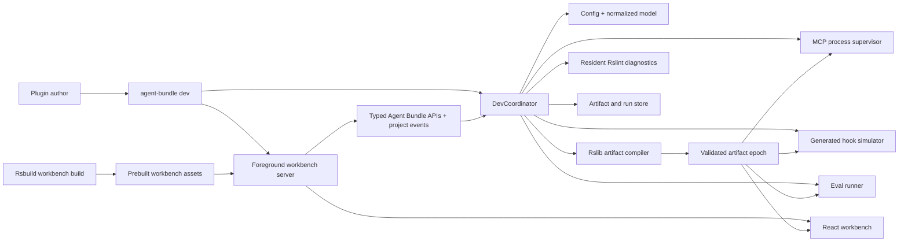
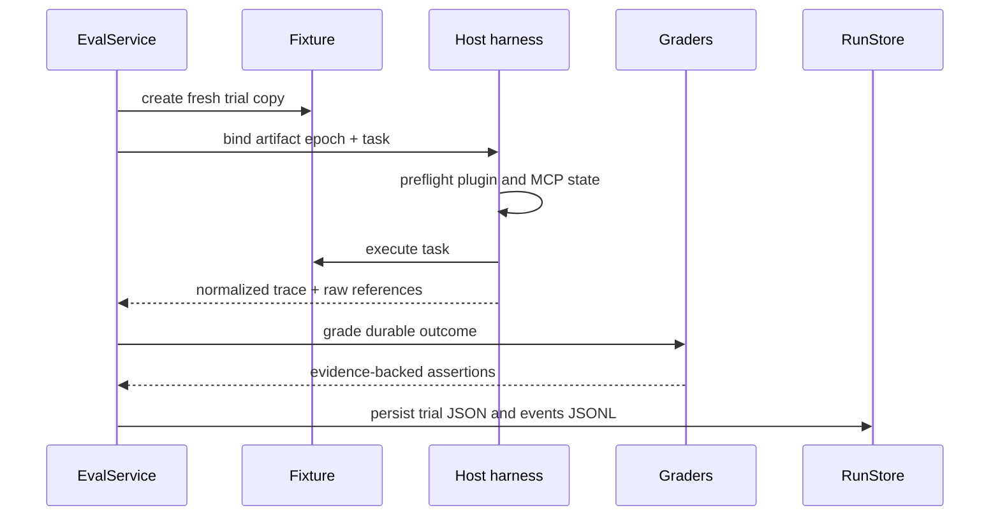

# Agent Bundle developer workbench design

**Status:** Proposed extension to the approved Agent Bundle architecture

**Date:** 2026-08-14

## Summary

`agent-bundle dev` is the development environment for authoring, inspecting, validating, and
evaluating agent plugins. It is not a static report and it is not a second agent host. It runs
as one foreground process with four coordinated responsibilities:

1. compile plugin artifacts with Rslib/Rspack;
2. serve a prebuilt Rsbuild React workbench with live project events;
3. exercise the whole plugin or individual Skill, MCP, and hook surfaces through shared
   application services;
4. run deterministic and native-host evaluation trials against immutable artifact epochs.

The workbench is useful to humans in a browser and to agents through the same typed service
layer. It does not introduce a daemon, database, hosted control plane, or runtime dependency in
generated plugins.

## Goals

1. Make every generated target inspectable before installing it into a real host.
2. Render Skill documents as polished documentation, including frontmatter and local resources.
3. Provide a protocol-level MCP playground bound to the exact generated artifact.
4. Simulate normalized hooks through the generated target wrapper rather than a separate model.
5. Run realistic plugin and Skill evals through native Codex and Claude CLI harnesses.
6. Keep source state, build state, host traces, and grader conclusions visibly distinct.
7. Preserve native Rsbuild HMR for the workbench while plugin artifacts rebuild independently.
8. Remain useful from the CLI and programmatic API when the browser is not open.

## Non-goals

- editing project source inside the browser;
- running as a background daemon after the command exits;
- auto-installing a candidate into the user's normal Codex or Claude configuration;
- calling, proxying, or replacing model-provider APIs, or managing their credentials;
- reproducing the full Codex or Claude interface;
- claiming that inferred Skill activation was directly observed;
- implementing a hosted eval service, team database, or marketplace;
- making Rsbuild frontend HMR stand in for plugin artifact invalidation.

## Tool assignment

Each Rstack tool has one job:

| Concern                                 | Tool         | Reason                                                              |
| --------------------------------------- | ------------ | ------------------------------------------------------------------- |
| Agent Bundle library and CLI output     | Rslib        | Produces the published ESM package and declarations.                |
| Generated hook, script, and MCP entries | Rslib/Rspack | Produces self-contained target executables.                         |
| Browser workbench                       | Rsbuild      | Builds the app and provides HMR while developing Agent Bundle.      |
| Source diagnostics                      | Rslint       | One resident engine lints affected files in the foreground process. |
| Unit and integration tests              | Rstest       | Tests compiler, adapters, UI behavior, and harness normalization.   |
| Eval trial orchestration                | Agent Bundle | Owns fixtures, host processes, traces, graders, and comparisons.    |

Rslib has a CLI watch mode, but the Agent Bundle product graph also contains Markdown,
frontmatter, references, copied assets, marketplace files, and generated manifests. Agent Bundle
therefore owns invalidation and calls the public Rslib build API for coalesced artifact epochs.
Rslint does not expose a native watch command; the coordinator reuses one long-lived `Rslint`
instance and schedules affected-file lint calls. Rstest's own watch command remains available for
developing Agent Bundle itself and reruns affected tests from its module graph.

## Process architecture



There is one process owner. Every child process, watcher, Rslint engine, Rsbuild server, and eval
trial belongs to its lifecycle and closes on Ctrl-C or programmatic `close()`.

## Rsbuild workbench build and foreground server

Rsbuild builds the React workbench. While contributing to Agent Bundle, its built-in dev server
provides React/CSS HMR and proxies the typed Agent Bundle APIs to a coordinator process. This is
the fast frontend-development loop.

The published CLI does not recompile the workbench for every plugin author. The package ships
prebuilt Rsbuild assets, and `agent-bundle dev` starts one lightweight foreground HTTP server
that serves those assets, typed APIs, and a project-event stream. Plugin-source changes are data
events that update the normalized model, diagnostics, artifact epochs, MCP sessions, hooks, and
eval runs; they are not workbench HMR.

The production workbench build disables filename hashing. Its prebuilt assets keep stable names;
versioning and integrity come from package/compiler manifests rather than content hashes embedded
in chunk filenames.

Both modes use the same browser application and service contracts:

- contributor mode: Rsbuild dev server + HMR + API proxy;
- published mode: prebuilt Rsbuild output + foreground Agent Bundle server + live project events.

The server binds to loopback in the first release. It checks browser origins and generates one
session token for routes that can start a process or expose the optional agent API. There is no
public-network binding option in the initial product.

The Agent Bundle CLI and workbench require Node.js 22.19 or newer, matching the tested toolchain of
the initial Inspector source snapshot. This tool runtime is separate from the configurable runtime
target of emitted plugin executables.

## Development coordinator

`DevCoordinator` is a small orchestration layer, not a second build system. It owns:

```ts
interface DevCoordinator {
  start(): Promise<DevSession>;
  rebuild(reason: Invalidation): Promise<ArtifactEpochResult>;
  status(): ProjectStatus;
  close(): Promise<void>;
}
```

Internally it delegates to focused services:

- `ProjectService`: loads config, discovers source components, and produces the normalized model;
- `ArtifactService`: builds and validates targets, then publishes immutable epochs;
- `DiagnosticService`: owns the resident Rslint instance and normalized diagnostics;
- `McpService`: starts generated MCP commands and exposes protocol operations;
- `HookService`: resolves native mappings and runs generated handlers with fixture events;
- `EvalService`: creates trials, launches harnesses, grades results, and compares runs;
- `RunStore`: persists schema-versioned JSON and JSONL artifacts.

Services are usable from the UI, CLI, and programmatic API. HTTP handlers contain no product
logic beyond input decoding and result encoding.

Cross-platform process contracts use Node path and spawning APIs rather than shell-joined command
strings. Generated JavaScript entries are `.mjs`; shell and Python sources are copied rather than
transpiled. POSIX builds validate executable modes where meaningful, while Windows treats mode as
metadata and clean-consumer tests prove that each generated command still launches correctly.

## Invalidation and artifact epochs

The watcher observes configuration, discovered skills, scripts, hooks, MCP sources, references,
assets, and target-specific extension files. Events are debounced into one invalidation batch.

```mermaid
sequenceDiagram
  participant FS as File watcher
  participant C as DevCoordinator
  participant L as Rslint
  participant B as Rslib build
  participant V as Artifact validator
  participant UI as Workbench

  FS->>C: changed paths
  par diagnostics
    C->>L: lint affected source
  and artifact rebuild
    C->>C: reload and normalize
    C->>B: compile selected target entries
    B->>V: emitted target directories
  end
  alt build and validation pass
    V-->>C: publish epoch N+1
    C-->>UI: artifact.available(N+1)
  else config, build, or validation fails
    V-->>C: failed attempt
    C-->>UI: artifact.failed; epoch N remains active
  end
```

An artifact epoch contains:

```ts
interface ArtifactEpoch {
  id: string;
  createdAt: string;
  projectRevision: string;
  configDigest: string;
  modelDigest: string;
  targetDigests: Record<TargetName, string>;
  manifestPath: string;
  diagnostics: DiagnosticSummary;
}
```

Only a fully emitted and validated build becomes active. On failure, the workbench keeps the last
good epoch available and labels it stale relative to the current sources. MCP processes and eval
trials never silently switch artifacts mid-run.

If files change during a build, the running build completes and the coordinator coalesces every
new invalidation into one queued follow-up build. It does not cancel a compiler in an unknown
state or start overlapping publications.

Epochs live under `.agent-bundle/epochs/<epoch-id>/<target>/`. Publication is atomic across the
selected targets: if any target fails, the entire attempted epoch fails and the previous epoch
remains active. Cleanup retains the active epoch, every epoch referenced by an MCP session or eval
run, and the five newest unreferenced epochs. Referenced epochs are deleted only after their final
session closes.

One `agent-bundle dev` process owns the project epoch store through `.agent-bundle/dev.lock` and
publishes an epoch by renaming a completed staging directory. A second dev process reports the
active owner instead of becoming a concurrent writer. Standalone evals create run-owned artifact
copies, and commands using `--artifact` are readers; neither participates in dev-epoch cleanup.
An abandoned lock may be recovered only after its recorded process is no longer running.

## Author configuration

The existing configuration gains optional development and eval sections:

```ts
export default defineConfig({
  // plugin, targets, skills, hooks, mcp, and other build fields
  dev: {
    open: true,
    port: 3100,
    lint: true,
    agentApi: false,
  },
  evals: {
    include: ["evals/**/*.eval.ts"],
    runsDir: ".agent-bundle/runs",
    semanticGrader: {
      harness: "claude",
      model: "claude-sonnet-4-5",
    },
  },
});
```

`dev.agentApi` enables an optional agent-facing Streamable HTTP MCP endpoint on the foreground
workbench server. It is off by default because ordinary plugin development does not require an
additional MCP server. CLI flags override config for one invocation.

Model-backed trials and semantic graders invoke the installed Claude Code or Codex CLI and reuse
that CLI's existing signed-in subscription/session. Agent Bundle does not accept, request,
inject, or store API keys or model-provider credentials. Harness preflight verifies that the
selected CLI is installed, supported, and able to start an authenticated run; otherwise it
returns an actionable CLI-authentication error.

## Workbench information architecture

### Overview

The landing page answers five questions without requiring navigation:

1. Did the current source normalize successfully?
2. Which artifact epoch is active, and is it current?
3. Which targets were generated?
4. Are there source, build, or artifact diagnostics?
5. What is the next useful action?

It shows a compact target matrix and the latest changed files. Raw logs remain one click away.

### Plugin playground

The Plugin Playground is the primary whole-product surface. The author selects an artifact epoch,
target host, fixture, and invocation, then either enters a natural-language prompt or directly
invokes a Skill, MCP operation, hook, or script.

One ordered timeline shows:

- plugin initialization and host preflight;
- Skill activation evidence;
- hook inputs, mappings, handler execution, and outputs;
- MCP connection lifecycle, requests, notifications, responses, logs, progress, and cancellation;
- generated script execution;
- host response and workspace changes;
- build, source, and artifact diagnostics associated with the exact epoch.

Every summarized row links to its raw event. A completed playground session can be replayed,
exported, or promoted to a draft eval case. Promotion captures the task, fixture, target, durable
outcome, and selected assertions; it does not bake incidental tool order into the eval.

### Skills

The Skill page has a tree on the left and three synchronized tabs:

- **Rendered**: polished Skill documentation;
- **Source**: exact source Markdown;
- **Generated**: selected target's emitted `SKILL.md` and resource tree.

It also shows parsed frontmatter, referenced scripts/references/assets, validation diagnostics,
and direct/indirect/negative eval coverage.

### MCP playground

The MCP page is an integrated Inspector-derived protocol workbench bound to one immutable
artifact epoch. It runs inside the Agent Bundle React tree with no iframe and no second web
application.

The workbench provides:

- selected target, generated command, arguments, working directory, and non-secret environment;
- Codex and Claude path-token expansion using the selected epoch as plugin root and a
  workbench-managed per-session plugin-data directory;
- explicit start, stop, restart, timeout, cancellation, and session controls;
- negotiated protocol version and client/server capabilities;
- tools, resources, resource templates, and prompts;
- JSON-Schema-generated forms with raw JSON mode;
- content blocks, structured content, protocol errors, timing, stderr, notifications, progress,
  and logging messages;
- invocation history, replay, config export, raw protocol frames, and promotion to a draft eval.

The initial client advertises tools, resources, prompts, progress, and logging. Unsupported client
features are shown as unsupported and return a defined error instead of hanging. Protocol versions
and schemas come from pinned public MCP SDK packages rather than being copied into Agent Bundle.
This is intentionally different from host and Agent Skills manifest schemas, which are vendored
snapshots because they validate emitted files rather than implement a live protocol.

The browser cannot spawn a generated stdio server directly. `McpService` therefore exposes an
Agent Bundle remote transport on the foreground server:

```text
Inspector-derived React/hooks
  -> AgentBundleRemoteTransport
  -> authenticated workbench session stream
  -> McpService process supervisor
  -> generated stdio or Streamable HTTP server from the selected epoch
```

Creating a session binds `{ epochId, target, serverName }`, resolves its generated command and
host environment once, creates a per-session plugin-data directory, and returns the negotiated
connection state. The bidirectional stream forwards JSON-RPC frames and separate stderr/log
events, supports request cancellation and session shutdown, and records each frame in the shared
plugin timeline before delivery. The browser never supplies an arbitrary executable path.

The official MCP Inspector is MIT licensed, and its current v2 architecture separates MCP client
state and React hooks from presentational web components. Because those modules are deliberately
not published as a supported downstream package, Agent Bundle vendors an allowlisted source
snapshot instead of importing private npm subpaths.

The initial snapshot may reuse and adapt:

- MCP client lifecycle, message tracking, output validation, and list state;
- React hooks over that state;
- tools, resources, prompts, Apps, content, protocol, network, progress, and log components;
- JSON argument/schema utilities and the relevant upstream fixtures.

It excludes the Inspector launcher, CLI, TUI, standalone Hono/Vite server shell, global server
catalog, sample servers, and unrelated persistence. Agent Bundle supplies transport/process
ownership, generated host environment expansion, artifact epochs, plugin-wide traces, replay, and
eval promotion.

Vendored code lives behind an internal `inspector-adapter` boundary. Its directory contains the
upstream repository, exact commit, copied path allowlist, license, and local patch record. Files
remain byte-identical where import aliasing and adapters suffice. Any unavoidable source edit must
be generated by a recorded patch rather than being an unexplained hand edit.

A maintainer-only sync script refreshes the snapshot from a new explicit commit; install, build,
and dev never fetch upstream source. `UPSTREAM.json` records upstream digests, applied patch files,
post-patch digests, the declared external dependency set, and the MCP SDK version used by that
Inspector commit. `THIRD_PARTY_NOTICES` and the Inspector MIT license ship in both the repository
and the published npm package containing the derived workbench assets. An upgrade must pass the
retained upstream tests plus Agent Bundle artifact-binding and playground contract tests. A change
to the required Node engine is treated as a semver-significant upgrade decision.

```text
packages/workbench/src/inspector/
├── adapter/                 # Agent Bundle transport, epoch, trace, and theme bindings
├── vendor/                  # allowlisted upstream source snapshot
├── UPSTREAM.json            # repository, commit, copied paths, and content digests
├── patches/                 # mechanically applied local source patches, normally empty
├── PATCHES.md               # intentional behavioral and import adaptations
└── LICENSE.inspector        # preserved MIT license
```

The sync command produces a reviewable diff and fails when an allowlisted upstream path moves or
introduces a dependency outside the declared set. It never overwrites `adapter/`.

The current Inspector web UI is Mantine-based. Agent Bundle declares the required Mantine and
React packages directly, includes vendored component paths in the Rsbuild compilation, and owns a
theme adapter rather than copying Inspector's application shell. Skill code rendering remains the
separate Shiki pipeline described below.

If Inspector later publishes an embeddable component/core API, the adapter can switch from the
vendored snapshot without changing the rest of the workbench. Agent Bundle also exports the exact
selected server config so an author can open the standalone official Inspector as an escape hatch,
but that external session is not the source of Agent Bundle provenance or eval evidence.

The playground always executes the generated command from the selected target. It never imports
the MCP source module directly, because that would bypass emitted paths, bundled dependencies,
target-specific environment expansion, and process behavior.

The initial integration decision is therefore:

| Option                                       | Decision | Reason                                                                |
| -------------------------------------------- | -------- | --------------------------------------------------------------------- |
| controlled vendoring of an allowlisted set   | primary  | Produces one integrated UI while retaining exact upstream provenance. |
| import unpublished npm subpaths              | no       | Private package paths are not a supported compatibility contract.     |
| iframe or proxy the entire Inspector web app | no       | Creates a nested app, second lifecycle, and disconnected UX.          |
| wholesale fork of the Inspector repository   | no       | Pulls in launcher, servers, clients, and persistence we do not need.  |
| export config for standalone Inspector       | escape   | Preserves the complete upstream tool for unusual debugging.           |

### Hooks

The Hook page shows normalized intent beside each host mapping:

```text
beforeTool + shell
  Codex  -> <adapter native event> / <native shell selector> / codex/hooks/check-command.mjs
  Claude -> <adapter native event> / <native shell selector> / claude/hooks/check-command.mjs
```

Paths are relative to the selected artifact root — an epoch directory in dev, `dist/` for a
production build.

Simulation accepts canonical fields or a saved fixture, transforms them into the selected host's
native event, runs the emitted wrapper, and decodes the native response back into a canonical
result. The page shows all three forms. This tests the compiled adapter rather than a separate
in-memory approximation.

### Artifacts

The Artifact page provides:

- target directory tree;
- source-to-output provenance;
- generated manifests with schema diagnostics;
- executable entry metadata;
- epoch-to-epoch file and digest diff;
- exact path used by MCP, hook, and eval operations.

### Evals

The Eval page provides:

- suites and cases;
- selected hosts, invocation mode, fixtures, and trial count;
- live trial status and normalized event trace;
- deterministic and semantic grader results;
- case-by-host/model matrix;
- pass rate, pass@k, pass^k, duration, and recorded token usage;
- baseline versus candidate comparison;
- links to raw run artifacts.

### Logs

Logs are grouped by producer: normalization, Rslib, Rslint, Rsbuild, MCP server, hook simulation,
host trial, and grader. The default view shows concise structured events; raw stdout/stderr is
available per process.

## Skill Markdown renderer

Skill documents need first-class rendering because they are the main authored interface.

The core parser reads YAML frontmatter and Markdown body once and returns:

```ts
interface SkillDocument {
  id: string;
  sourcePath: string;
  frontmatter: Record<string, unknown>;
  body: string;
  resources: SkillResource[];
  diagnostics: Diagnostic[];
}
```

The browser uses:

- `react-markdown` for React rendering;
- `remark-gfm` for tables, task lists, strikethrough, and autolinks;
- a lazy fine-grained Shiki integration for fenced code blocks;
- custom heading, link, image, table, code, and callout components.

The browser does not parse frontmatter again. It renders the structured metadata as a compact
field list above the document. Local links and images resolve through the workbench API using the
skill source path or selected artifact epoch. Clicking a source reference can reveal it in the
resource tree or open it in the user's editor.

Rendered view resolves relative links from the authored Skill source. Generated view resolves
them from the selected immutable epoch. Each view labels its base so a valid source link cannot be
mistaken for a valid generated link.

The initial renderer supports CommonMark and GFM, not MDX. JSX in a Skill file is shown as text
instead of executed, raw HTML remains inert, and Mermaid fences render as code in the first
release. Shiki languages and themes are loaded lazily so opening the workbench does not download
the full highlighter bundle.

## Agent-facing development MCP

When enabled, the workbench exposes a small Streamable HTTP MCP server backed by the same
services as the UI:

```text
project_status
skills_list
skill_inspect
artifacts_list
artifact_inspect
mcp_servers_list
mcp_invoke
hooks_list
hook_simulate
evals_list
eval_run
eval_get
diagnostics_list
```

This endpoint helps an agent inspect the plugin it is authoring. It is not embedded in generated
artifacts and exists only while `agent-bundle dev --agent-api` is running.

## Eval definition model

Eval suites are typed TypeScript modules discovered by convention:

```ts
import { defineEvalSuite } from "agent-bundle/eval";

export default defineEvalSuite({
  name: "review-change",
  cases: [
    {
      id: "direct-review",
      prompt: "Review this change and report the highest-risk regression.",
      fixture: "./fixtures/review-repo",
      hosts: {
        codex: { model: "gpt-5.5-codex" },
        claude: { model: "claude-sonnet-4-5" },
      },
      invocation: {
        mode: "automatic",
        skill: "review-change",
      },
      trials: 3,
      assertions: [
        expectExitCode(0),
        expectOutcome({ script: "./graders/review-result.ts" }),
        expectMcpCall({ server: "project", tool: "status", atLeast: 1 }),
        expectSkillActivation({
          skill: "review-change",
          minimumEvidence: "inferred",
        }),
      ],
    },
  ],
});
```

Invocation modes are:

- `automatic`: ask naturally and measure whether the host uses the plugin effectively;
- `explicit`: directly name or invoke the Skill to test its workflow after activation;
- `none`: negative case where the plugin should not be selected.

A useful suite includes direct, indirect, incomplete-information, negative, and edge cases. Eval
prompts do not include assertions, expected grader decisions, reference answers, or another
trial's outputs.

Negative assertions such as `expectNoSkillActivation()` make non-selection behavior explicit.
Fixture materialization copies only an allowlisted file set, initializes a Git repository and
baseline commit when the task requires repository state, and records the resulting fixture
digest before any trial begins.

## Trial and grader model

The core vocabulary is explicit:

- **case**: one task, fixture, invocation mode, and assertion set;
- **trial**: one fresh execution of a case through a selected harness;
- **trace**: normalized host/process events plus references to raw output;
- **outcome**: final workspace and response state;
- **grader**: deterministic, model-based, or human judgment over the outcome;
- **run**: a group of cases and trials against one artifact epoch;
- **comparison**: aligned baseline and candidate runs.

Graders prefer durable outcomes over exact tool sequences. Deterministic checks run first:

- process exit and timeout;
- file/artifact existence and content;
- JSON Schema validation;
- repository checks or custom scripts;
- required or forbidden tool/MCP calls when they are part of the contract.

Optional semantic graders receive the task, assertions, final response, trace, and produced
workspace. They do not receive condition labels such as `with_skill` or `without_skill`.

Every assertion resolves to `pass`, `fail`, or `inconclusive`. An assertion that requires stronger
evidence than the harness provides is inconclusive, never silently passed. Evidence-sensitive
assertions declare their minimum accepted level.

One or two trials are smoke checks. Reliability comparisons require at least three trials per
aligned condition. The UI displays the actual `k/n` beside pass@k and pass^k. Baseline and
candidate trials are comparable only when case, host, pinned model, host CLI version, fixture
digest, invocation, and grader versions align; mismatches are labeled non-comparable instead of
being folded into a delta.

## Skill activation evidence

Activation telemetry differs by host. Agent Bundle stores an evidence level rather than forcing
false parity:

```ts
type ActivationEvidence = "observed" | "inferred" | "unavailable";
```

- Claude can expose Skill tool calls in its stream, so matching activation is `observed`.
- Codex plugin availability is observed through plugin state, while automatic Skill activation
  is `inferred` from behavior unless the CLI later exposes an authoritative event.
- A harness that cannot inspect either records `unavailable`.

Graders and reports may reason about inference, but must not relabel it as observation.

## Harnesses

### Deterministic harness

Runs without a model. It validates artifact trees, Skill resources, hook wrappers, scripts, and
MCP protocol behavior. It is the default in CI because it is fast and repeatable.

### Claude native harness

Claude supports direct plugin loading with `--plugin-dir`. The native CLI harness runs `claude -p`
with the candidate's explicit plugin directory and the author's existing Claude Code
subscription/session; it never supplies an API key and does not use `--bare`, which would bypass
saved subscription authentication. A fresh fixture and explicit plugin directory isolate the
candidate content. Inherited CLI runtime controls are recorded with the run.

The harness uses JSON or stream-JSON output and records the system initialization event, loaded
plugin, plugin errors, MCP state, Skill tool calls, hooks when emitted, tool calls, result, usage,
and raw stderr.

### Codex native harness

Codex does not provide a direct `--plugin-dir` equivalent. For an isolated trial, Agent Bundle:

1. creates a temporary `CODEX_HOME`;
2. copies the active CLI's existing `auth.json` into that home as opaque auth state, preserving
   its permissions and never parsing or modifying the source file;
3. materializes a temporary local marketplace referencing the generated Codex target;
4. installs the candidate with `codex plugin marketplace add` and `codex plugin add`;
5. verifies it with `codex plugin list --json`;
6. runs `codex exec --ephemeral --json` from a fresh fixture copy.

This reuses the author's already authenticated Codex subscription/session without accepting or
supplying an API key. Candidate plugin and configuration state remain isolated from the normal
Codex home, which Agent Bundle does not modify. Manual dogfooding of an already user-installed
release can be recorded as an external run, but it is not comparable to an isolated candidate
trial unless every alignment field matches.

### Future harness adapter

A narrow adapter interface may support external systems such as Inspect AI or Promptfoo. Native
CLI harnesses remain distinct because a bridge that reroutes model calls can change plugin-host
behavior.

## Clean trial lifecycle



Each trial starts from the same fixture digest. A candidate and baseline never share a mutable
workspace. Host startup, authentication, plugin-load, MCP-startup, timeout, or trace-collection
failures are harness failures rather than plugin failures.

## Run storage

No database is required. State is schema-versioned and inspectable:

```text
.agent-bundle/
└── runs/
    └── <run-id>/
        ├── run.json
        ├── events.jsonl
        ├── comparison.json
        ├── cases/
        │   └── <case-id>/
        │       └── <trial-id>.json
        └── artifacts/
            └── ...
```

Run provenance includes:

- Agent Bundle version and schema version;
- project revision and dirty-state digest;
- artifact epoch and target digests;
- fixture digest;
- host CLI and plugin versions;
- selected harness and pinned model;
- timing, exit state, usage when reported, and raw log references;
- grader versions and assertion evidence.

One process owns a run directory through an explicit lock and is its only writer. A second
process creates a new run rather than appending to an active run. Readers may tail completed JSONL
records without mutating them.

## CLI and API

```bash
agent-bundle dev [--open | --no-open] [--port 3100] [--agent-api]
agent-bundle inspect --json
agent-bundle mcp list
agent-bundle mcp invoke <server> <tool> --input '{...}'
agent-bundle hooks list
agent-bundle hooks simulate <hook> --target claude --input fixture.json
agent-bundle eval [suite-or-case] --host codex --trials 3
agent-bundle eval compare <baseline-run> <candidate-run>
```

Programmatic entry points return structured handles and never require a browser:

```ts
const session = await startDevServer({ root, open: false });
const run = await runEvals({
  root,
  cases: ["direct-review"],
  hosts: ["claude"],
});
await session.close();
```

`--no-open` keeps the browser closed while still serving the workbench. Headless build, inspect,
MCP, hook, and eval work uses their dedicated CLI commands instead of maintaining a second
headless dev-server mode.

Standalone `mcp invoke` and `hooks simulate` build and validate a temporary current-source epoch
by default. `--artifact <manifest>` selects a specific validated epoch instead. They never guess
an ambient output directory from modification time.

## Error and recovery behavior

- A config or normalization error prevents a new artifact epoch and leaves the last good epoch
  visible as stale.
- A target-specific build failure fails the attempted epoch atomically and leaves the previous
  complete epoch active.
- MCP startup and protocol errors are attached to the selected server and epoch.
- A malformed hook fixture is rejected before the generated command runs.
- A host CLI that is missing, unauthenticated, or incompatible fails preflight and creates a
  harness-failure trial record.
- A grader failure preserves the completed host trace and marks grading incomplete.
- Workbench API failures use stable diagnostic codes and actionable messages rather than raw
  stack traces as the primary UI.

## Testing strategy

### Compiler and coordinator

- invalidation coalescing;
- successful epoch publication;
- failed build retains last good epoch;
- deterministic digests and target selection;
- complete shutdown without leaked watchers or children.

### Rsbuild workbench

- contributor-mode API proxy and React/CSS HMR;
- published-mode prebuilt assets, route availability, and live project events;
- identical browser-service contracts in both modes;
- workbench closes with the coordinator.

### Skill renderer

- YAML frontmatter shown separately;
- CommonMark and GFM tables, task lists, links, and code;
- lazy highlighted code blocks;
- relative source and artifact images;
- source/rendered/generated parity;
- raw HTML and MDX/JSX remain inert text;
- Mermaid fences remain code in the first release.

### MCP and hooks

- generated stdio MCP initialization and catalog operations;
- input forms and raw JSON produce identical calls;
- process restart binds the selected epoch;
- the vendored Inspector subset retains its selected upstream fixtures and license metadata;
- Inspector-derived controls execute through Agent Bundle's epoch-bound MCP session service;
- exported standalone-Inspector config contains the same resolved command and non-secret env;
- hook simulation executes the emitted target wrapper;
- canonical/native input and output round-trip fixtures.

### Evals

- fresh, equal fixture copies;
- deterministic assertion evidence;
- host preflight and failure classification;
- Claude and Codex trace normalization;
- observed, inferred, and unavailable activation states;
- multi-trial aggregation and baseline comparison;
- raw artifacts remain sufficient to reproduce a displayed conclusion.

Workbench browser flows run with Rstest Browser Mode and Playwright Chromium. Native harness
smokes remain process-level integration tests rather than browser mocks.

### Phase-zero contract spikes

Before shared implementation, seven disposable fixtures turn external assumptions into checked-in
contracts:

1. **Inspector allowlist:** copy the candidate paths at one commit, build them under Rsbuild,
   retain relevant upstream tests under Rstest, wire Mantine through the theme adapter, reject
   Vite-only APIs or undeclared imports, and emit the first `UPSTREAM.json`.
2. **Browser-to-stdio bridge:** initialize, list tools, call one tool, receive stderr/progress, and
   cancel a request through `AgentBundleRemoteTransport` against a generated epoch fixture.
3. **Claude contract:** load a handwritten plugin with the supported direct-plugin flag through
   the existing signed-in subscription/session, without `--bare` or an API key; observe stream
   output and hooks, and record the minimum CLI version and capability fixture.
4. **Codex lifecycle:** use a temporary `CODEX_HOME` and marketplace, reuse the active CLI's
   opaque `auth.json`, install and verify a handwritten candidate, run an ephemeral JSON trial,
   and prove both that no API key is requested and that the normal user home is unchanged.
5. **Path tokens:** verify real Claude and Codex plugin-root/data expansion plus portable
   `${PLUGIN_ROOT}` and `${PLUGIN_DATA}` expansion in `args`, `env`, and `cwd` (not `command`)
   against the selected host/spec versions.
6. **Activation evidence:** record exactly which Claude and Codex events justify `observed`,
   `inferred`, or `unavailable` activation claims.
7. **Epoch atomicity:** prove rename publication and dev-lock behavior, including stale-lock
   recovery and a second writer attempt, on supported operating systems.

The spikes may be thrown away after their fixtures and contract notes are captured. Their purpose
is to prevent an attractive abstraction from preceding evidence about the real hosts and upstream
Inspector source.

## Delivery phases

0. Handwritten Codex and Claude contract spikes, minimum supported CLI versions, capability
   fixtures for every initial adapter, and an Inspector vendoring spike that proves the exact
   allowlist builds under Rsbuild without unpublished package imports.
1. `DevCoordinator`, atomic artifact epochs, Rslib rebuilds, and structured status.
2. Rsbuild React build, contributor HMR path, and published foreground server.
3. Skill browser and Markdown renderer.
4. Native MCP session service, integrated Inspector-derived components, and generated-hook
   simulator.
5. Whole-plugin playground, ordered trace, replay, and promotion to a draft eval.
6. Deterministic eval definitions, run store, graders, and CLI.
7. Claude native harness.
8. Codex native harness.
9. Comparison matrix, optional agent-facing MCP, and clean-consumer dogfood.

Each phase is a usable vertical slice. The UI does not precede the services it presents, and
native model trials do not precede deterministic artifact checks.

## Decisions

1. The workbench is an Rsbuild React app; contributors get native HMR and published consumers get
   prebuilt assets plus live project events.
2. `agent-bundle dev` owns one lightweight foreground server rather than recompiling the UI for
   every plugin project.
3. Rslib builds the Agent Bundle package and generated plugin executables.
4. Agent Bundle owns broad source invalidation and publishes immutable artifact epochs.
5. One resident Rslint engine supplies affected-file diagnostics; there is no invented Rslint
   watch mode.
6. Rstest's native watch mode develops Agent Bundle itself; eval trials remain explicitly
   scheduled and persisted.
7. `react-markdown`, `remark-gfm`, and lazy fine-grained Shiki render Skills; core parses
   frontmatter once.
8. MCP and hook tools execute generated artifacts rather than source shortcuts.
9. Agent Bundle vendors an attributed, allowlisted MCP Inspector source snapshot behind an internal
   adapter; it does not iframe the standalone app or import unpublished npm paths.
10. Eval harnesses distinguish deterministic execution from native CLI execution; native trials
    use fresh fixtures and isolated candidate/plugin state while reusing the CLI's existing
    signed-in subscription/session.
11. Activation claims carry `observed`, `inferred`, or `unavailable` evidence.
12. JSON and JSONL files are the first run store; there is no database.
13. The optional agent-facing MCP shares application services and lives only for the foreground
    dev session.

## Research basis

- [Rsbuild instance and dev server](https://rsbuild.rs/api/javascript-api/instance)
- [Rsbuild middleware mode](https://rsbuild.rs/config/server/middleware-mode)
- [Rsbuild environment hot events](https://rsbuild.rs/api/javascript-api/environment-api)
- [Rslib CLI watch](https://lib.rsbuild.dev/guide/basic/cli)
- [Rslib JavaScript API](https://lib.rsbuild.dev/api/start/)
- [Rslint JavaScript API and lifecycle](https://rslint.rs/guide/js-api)
- [Rstest CLI and watch mode](https://rstest.rs/guide/basic/cli)
- [Rstest Reporter API](https://rstest.rs/api/javascript-api/reporter)
- [Codex plugin packaging](https://developers.openai.com/plugins/build/plugins)
- [Codex non-interactive mode](https://learn.chatgpt.com/docs/non-interactive-mode)
- [OpenAI evaluation best practices](https://developers.openai.com/api/docs/guides/evaluation-best-practices)
- [Claude Code plugins](https://code.claude.com/docs/en/plugins)
- [Claude Code headless mode](https://code.claude.com/docs/en/headless)
- [MCP Inspector](https://modelcontextprotocol.io/docs/tools/inspector)
- [MCP Inspector source and architecture](https://github.com/modelcontextprotocol/inspector)
- [MCP debugging guide](https://modelcontextprotocol.io/docs/tools/debugging)
- [Anthropic: Demystifying evals for AI agents](https://www.anthropic.com/engineering/demystifying-evals-for-ai-agents)
- [Inspect AI](https://inspect.aisi.org.uk/)
- [Promptfoo](https://www.promptfoo.dev/docs/intro/)
- [react-markdown](https://github.com/remarkjs/react-markdown)
- [Shiki rehype integration](https://shiki.style/packages/rehype)
